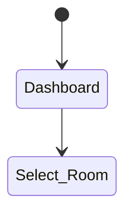

# Booking System via Websocket

## TechStack

### Frontend
- NextJS
- Tailwind
- Deployment via [Vercel](vercel.com)

### Backend
- NestJS
- Database
  - [Supebase](supabase.com)
- SocketIO

## Client

- [x] Dashboard Page
  - [x] Rooms List
  - [ ] Gen UserID and Profile via Socket Sessions
- [ ] Rooms Detail Page
  - [ ] Waiting Queue
  - [ ] Seat List (5 Seat per room)
  - [ ] Seat Selectors
- [ ] Admin Page
  - [ ] Rooms List
    - [ ] Status
  - [ ] Add Room Button
  - [ ] Clear Room Booked Button
  - [ ] Rooms Detail Page
    - [ ] List of booked/waiting seats

## Backend

- [ ] Rooms CRUD API
- [ ] Bookings API

## Booking Logic

